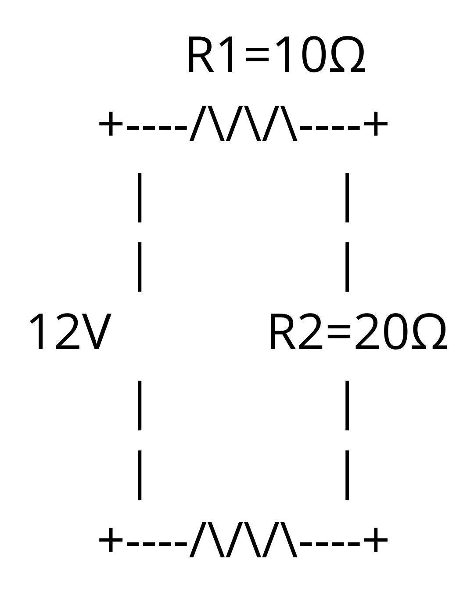
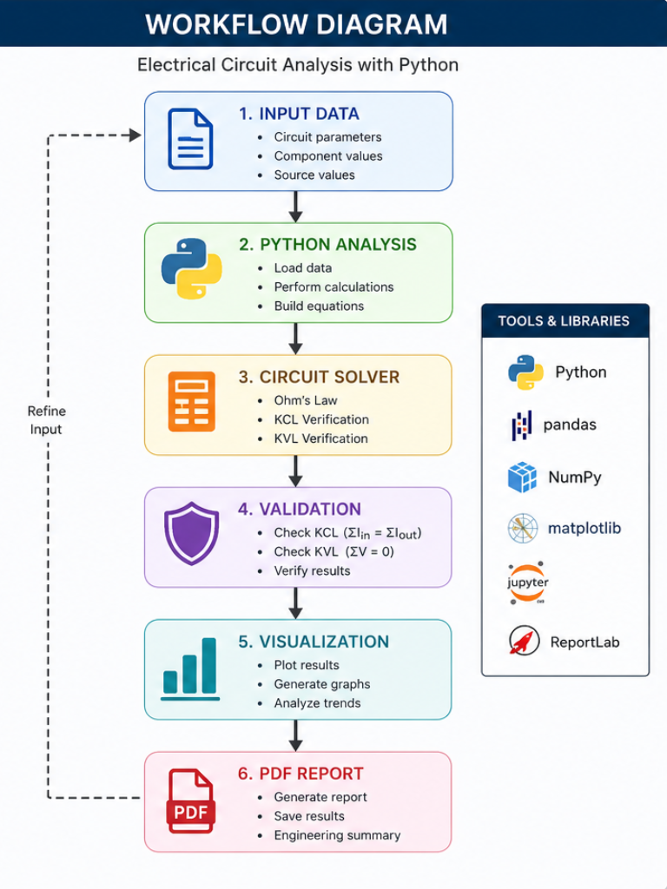
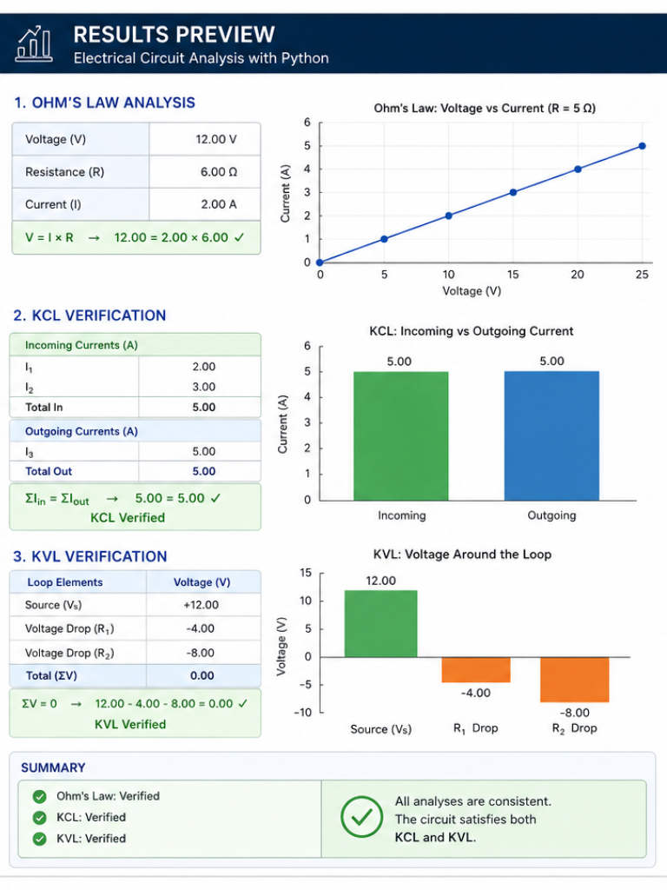

# Electrical Circuit Analysis with Python


## Overview

This project demonstrates fundamental electrical engineering analysis using Python. It covers core circuit analysis concepts including Ohm's Law, Kirchhoff's Current Law (KCL), and Kirchhoff's Voltage Law (KVL).

The repository includes engineering calculations, Jupyter Notebook demonstrations, automated testing, report generation, and visual documentation to showcase practical Python applications in electrical engineering.

---

## Circuit Under Study



Example resistive circuit used for demonstrating Ohm's Law, KCL, and KVL validation.

## Project Structure

```text
electrical-circuit-analysis-python/

├── data/
│   └── sample_circuit_data.csv
│
├── notebooks/
│   ├── ohms_law.ipynb
│   ├── kcl_analysis.ipynb
│   └── kvl_analysis.ipynb
│
├── src/
│   └── circuit_solver.py
│
├── reports/
│   ├── analysis_report.pdf
│   └── generate_report.py
│
├── tests/
│   └── test_circuit_solver.py
│
├── assets/
│   ├── workflow_diagram.png
│   └── results_preview.png
│
├── requirements.txt
├── circuit_diagram.png
└── README.md
```

---

## Features

- Ohm's Law calculations
- Kirchhoff's Current Law (KCL) verification
- Kirchhoff's Voltage Law (KVL) verification
- Circuit analysis using Python
- Automated testing with PyTest
- Engineering report generation in PDF format
- Data visualization and result presentation
- Jupyter Notebook examples for educational and analytical purposes

---

## Technologies Used

- Python
- NumPy
- Pandas
- Matplotlib
- Jupyter Notebook
- PyTest
- ReportLab

---

## Engineering Topics Covered

### Ohm's Law

Calculate:

- Voltage (V)
- Current (I)
- Resistance (R)

Using:

```text
V = I × R
I = V / R
R = V / I
```

### Kirchhoff's Current Law (KCL)

Verify current conservation at electrical nodes:

```text
Σ I_in = Σ I_out
```

### Kirchhoff's Voltage Law (KVL)

Verify voltage conservation in closed loops:

```text
Σ V = 0
```

---

## Visual Assets

## Workflow Diagram




Illustrates the complete workflow:

```text
Input Data
    ↓
Python Analysis
    ↓
Circuit Solver
    ↓
Validation (KCL/KVL)
    ↓
Visualization
    ↓
PDF Report
```

## Results Preview



Contains example outputs, plots, and calculation results generated during circuit analysis.

---

## Report Generation

The project includes an engineering report generated automatically using Python.

Generated Report:

```text
reports/analysis_report.pdf
```

Source Code:

```text
reports/generate_report.py
```

The report summarizes:

- Ohm's Law calculations
- KCL verification
- KVL verification
- Engineering conclusions

---

## Testing

Run automated tests:

```bash
pytest tests/
```

Test file:

```text
tests/test_circuit_solver.py
```

Covered functions:

- Current calculation
- Voltage calculation
- Resistance calculation

---

## Example Use Cases

- Electrical engineering education
- Circuit analysis demonstrations
- Engineering computation with Python
- Technical portfolio projects
- AI-assisted engineering workflows
- Validation of basic circuit laws

---

## Installation

Clone the repository:

```bash
git clone https://github.com/koswadi/electrical-circuit-analysis-python.git
```

Install dependencies:

```bash
pip install -r requirements.txt
```

Launch Jupyter Notebook:

```bash
jupyter notebook
```

---

## Future Improvements

- AC circuit analysis
- Complex impedance calculations
- Nodal analysis solver
- Mesh analysis solver
- SPICE data integration
- Interactive visualization dashboard

## Sample Output

```python
Voltage = 24 V
Resistance = 8 Ω

Current = Voltage / Resistance
Current = 3 A

## Mathematical Foundation

Ohm's Law:

I = V / R

Kirchhoff's Current Law:

Σ I = 0

Kirchhoff's Voltage Law:

Σ V = 0

## Skills Demonstrated

- Electrical Engineering Fundamentals
- Circuit Analysis
- Scientific Computing
- Data Analysis
- Engineering Visualization
- Python Programming
- Automated Testing
- Technical Documentation
- Report Automation

## Repository Highlights

✔ Modular Python Architecture

✔ Automated Engineering Calculations

✔ Test-Driven Validation

✔ Professional Documentation

✔ Engineering Visualization

✔ Reproducible Analysis Workflow

---

## Author

Agoes Koswadi

Electrical Engineering & Python Portfolio Project

## Workflow


## Results Preview

